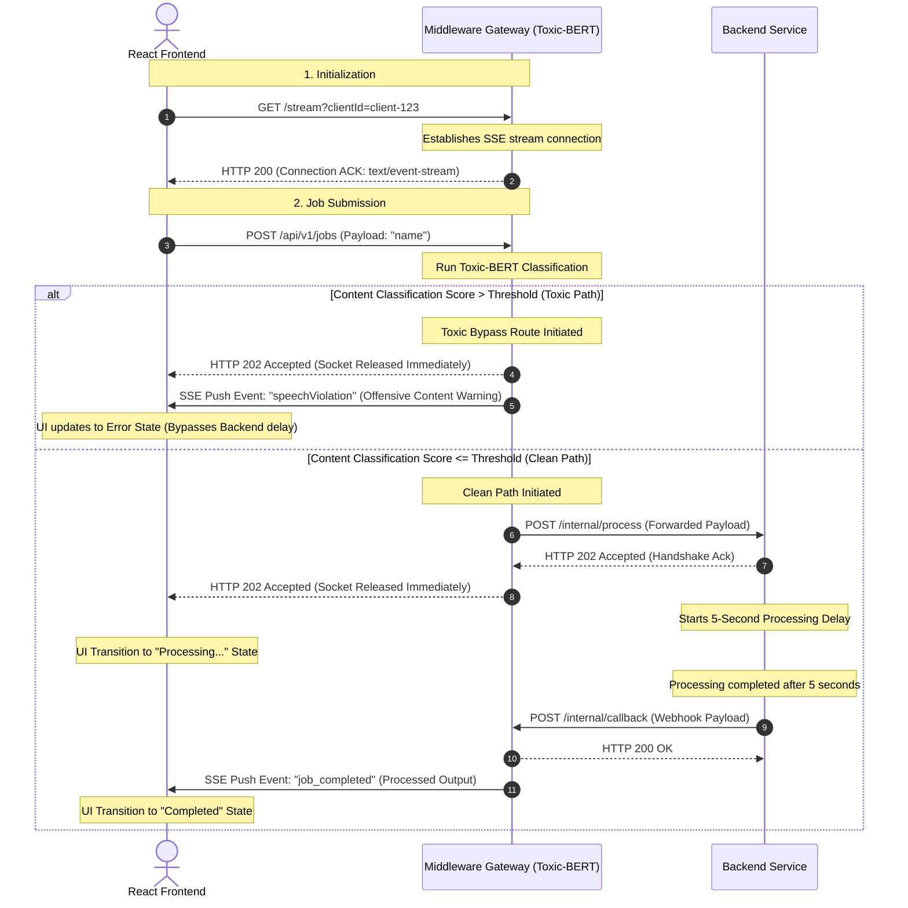

# System Architecture: Toxic-BERT Integration Project

This document details the architectural specifications, network topology, and sequence logic for the 3-tier containerized asynchronous pipeline with edge-level toxicity moderation.

---

## 1. Server-Sent Events (SSE) Stream Persistence Mechanics

Server-Sent Events (SSE) provide a low-overhead, persistent, unidirectional push channel from the Middleware API Gateway to the React Frontend. Unlike WebSockets, which are bidirectional and use a custom protocol, SSE runs over standard HTTP, leveraging native browser auto-reconnection and simple text-based framing.

### Connection Handshake & Lifecycle
- **Initiation**: The React Frontend opens a persistent HTTP connection to the Middleware via the `/stream?clientId=<UNIQUE_ID>` endpoint.
- **Handshake Headers**: The Middleware Gateway acknowledges the request and elevates the connection by writing the following HTTP headers:
  - `Content-Type: text/event-stream`: Identifies the stream as an SSE channel.
  - `Cache-Control: no-cache`: Disables downstream caching proxies (essential to prevent buffering).
  - `Connection: keep-alive`: Informs the server and intermediaries to keep the TCP socket open indefinitely.
  - `Access-Control-Allow-Origin: *` (or specific origin): Permits cross-origin resource sharing if the frontend resides on a separate domain/port.
- **Connection Keep-Alive (Heartbeat)**: To prevent intermediate reverse proxies or load balancers from killing idle sockets, the Gateway dispatches a heartbeat ping (`: keep-alive\n\n`) at standard 15-second intervals.
- **Termination**: If the client closes the browser tab or navigates away, the socket emits a `close` event. The Gateway catches this event, cleans up the connection reference, and releases in-memory sockets to avoid resource leaks.

---

## 2. Docker Network Topology & Routing Mechanics

The system operates within an isolated Docker bridge network (named `poc-net`), allowing secure internal DNS lookup and service segregation.

```
       [ Public Internet / Host Network ]
                       │
                       ▼ Port 3000 (Ingress)
            ┌─────────────────────┐
            │   React Frontend    │
            └──────────┬──────────┘
                       │
         ┌─────────────┴─────────────┐
         ▼ Port 3001 (Ingress)       ▼ Port 3001 (SSE Channel)
┌────────────────────────────────────────────────────────┐
│               Express Middleware Gateway               │
│         [ Embeds: Toxic-BERT via ONNX Runtime ]        │
└──────────────────────┬─────────────────────────────────┘
                       │
                       │ (Internal Docker DNS: backend-service:3002)
                       ▼ Port 3002 (Egress Callback Webhook /internal/callback)
┌────────────────────────────────────────────────────────┐
│                 Isolated Backend API                   │
│          [ Simulates Asynchronous Queue ]              │
└────────────────────────────────────────────────────────┘
```

### Network Topology Specifications
1. **Frontend Isolation**: The React Frontend runs on port 3000. It is exposed to the host network so that end-users can access the web application interface.
2. **Gateway Ingress**: The Express Middleware Gateway runs on port 3001 and is bound to the host network interface. It acts as the single ingress controller for all client actions (SSE registration and job submissions).
3. **Internal Routing & Name Resolution**: The Gateway communicates with the isolated Backend Service using its Docker service name (`backend-service`) and internal port (`3002`). Docker's embedded DNS server resolves `backend-service` directly to the container's private IP.
4. **Out-of-Band Callback Routing**: Upon completing background tasks, the Backend container performs an out-of-band POST request back to the Gateway (`middleware-gateway:3001/internal/callback`). This callback is isolated within the internal network.

---

## 3. Horizontal Architecture & Sequence Flow Diagram

The core system logic forks conditionally based on the content classification score evaluated by the edge-moderation model (Toxic-BERT running locally on the Gateway via ONNX runtime).

### 3-Tier Horizontal Architecture Diagram

```text
+-------------------------------------------------------------------------------------------------------+
|                                         DOCKER BRIDGE NETWORK                                         |
|                                                                                                       |
|  [frontend]                         [middleware-gateway]                           [backend-service]  |
|  (Port 3000)                            (Port 3001)                                   (Port 3002)     |
+------+------+                           +----+-----+                                  +-------+-------+
       |                                       |                                                |
       | ----- 1. GET /stream (Handshake) ---> |                                                |
       | <---- 2. HTTP 200 Stream Live ACK --- |                                                |
       |                                       |                                                |
       | ----- 3. POST /api/v1/jobs ---------> | [ Runs Toxic-BERT Check ]                      |
       |                                       |                                                |
       |                                       |-- IF TOXIC:                                    |
       | <---- 4a. HTTP 202 (Request ACK) -----|  * Abort Backend Routing                       |
       | <---- 4b. SSE Push: "Offensive Speech"|  * Instant Channel Push                        |
       |                                       |                                                |
       |                                       |-- IF CLEAN:                                    |
       | <---- 5a. HTTP 202 (Request ACK) -----|  * 4c. Forward Job --------------------------> | [ Enters 5s Delay ]
       |                                       |                                                | [ setTimeout Loop ]
       |                                       |                                                |
       |                                       |                                                | *5 Seconds Pass*
       |                                       | <--- 6. HTTP Webhook Callback (Job Completed) -|
       | <---- 7. SSE Push (Render Result) ----|                                                |
```

### Sequence Flow Diagram


